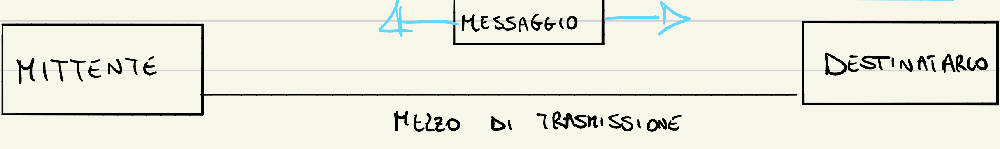

<h1 align="center">Reti di Calcolatori - UNISA</h1>
<h3 align="center">Riassunto</h3>
<h3>INTRODUZIONE ALLE RETI</h3>
 

**ICT** --> Tecnologie per il trattamento e la trasmissione dell'informazione

\- CHE COS'é INTERNET?
- Un'infrastruttura di comunicazione che consente il trafermento di dati tra dispositivi collegati alla rete (indipendentemente dal tipo di dispositivi e dal tipo di dsti digitali che si vuole trasmettere).

Il termine **RETE** è molto generico e si applica i tantissimi ambiti
* Insieme di elementi (**NODI**) tra i quali sono definite delle relazioni (**COLLEGAMENTI**)

Una **RETE DI CALCOLATORI** connette dispositivi programmabili e può supportare applicazioni differenti e trasportare qualsiasi tipo di dati

La **COMUNICAZIONE** consente lo scambio di dati tra due dispositivi, può essere locale o remota(Tele-comunicazione) e coinvolge sia hardware che software.
Le informazioni sono rappresentate tramite i dati

**COMUNICAZIONE DATI = SCAMBIO DI DATI CHE RAPPRESENTANO L'INFORMAZIONE**  

La comuniazione dati avviene attraverso un mezzo trasmissivo

**SISTEMA DI COMUNICAZIONE**
* MESSAGGIO
* MITTENTE
* DESTINATARIO
* MEZZO TRASMISSIVO
* PROTOCOLLO

\# Immagine della comunicazione mittente --- messaggio --- destinatario

**TIPO DI CONNESSIONE:**
* PUNTO PUNTO

* MULTIPUNTO

**COMUNICAZIONE**
* UNIDIREZIONALE

* BIDIREZIONALE ALTERNATA

* BIDIREZIONALE (FULL DUPLEX)

La **connessione diretta** (sia punto punto che multipunto) è adatta solo a reti piccole perché il numero di collegamenti è limitato al numero di porte presenti nel nodo, e non è **scalabile**

La **connessione "indiretta"** permette di creare reti "grandi" ed economiche
img

É composta da 2 tipi di nodi
* Terminali
* Commutazione
	* collegamenti ad almeno 2 linee
	* hanno la funzione di smistare il traffico
	* non ci sono utenti su questi nodi

  
