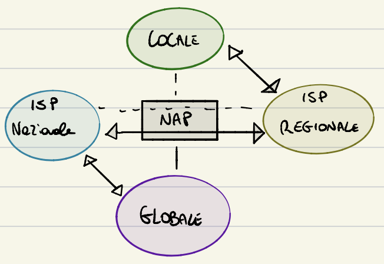

<h1 align="center">Reti di Calcolatori - UNISA</h1>
<h3 align="center">Riassunto</h3>
<h3>INTRODUZIONE ALLE RETI</h3>
 

**ICT** Tecnologie per il trattamento e la trasmissione dell'informazione

CHE COS'é INTERNET?
- Un'infrastruttura di comunicazione che consente il trafermento di dati tra dispositivi collegati alla Rete (indipendentemente dal tipo di dispositivi e dal tipo di dati digitali che si vuole trasmettere).

Il termine **RETE** è molto generico e si applica i tantissimi ambiti
* Insieme di elementi (**NODI**) tra i quali sono definite delle relazioni (**COLLEGAMENTI**)

Una **RETE DI CALCOLATORI** connette dispositivi programmabili e può supportare applicazioni differenti e trasportare qualsiasi tipo di dati

La **COMUNICAZIONE** consente lo scambio di dati tra due dispositivi, può essere locale o remota(Tele-comunicazione) e coinvolge sia hardware che software.
Le informazioni sono rappresentate tramite i dati

**COMUNICAZIONE DATI = SCAMBIO DI DATI CHE RAPPRESENTANO L'INFORMAZIONE**  

La comuniazione dati avviene attraverso un mezzo trasmissivo

<h4>SISTEMA DI COMUNICAZIONE:</h4>

* MESSAGGIO
* MITTENTE
* DESTINATARIO
* MEZZO TRASMISSIVO
* PROTOCOLLO

<h4>TIPO DI CONNESSIONE:</h4>

* **PUNTO PUNTO**

* **MULTIPUNTO**

<h4>COMUNICAZIONE:</h4>

* **UNIDIREZIONALE**

* **BIDIREZIONALE ALTERNATA**

* **BIDIREZIONALE (FULL DUPLEX)**

La **connessione diretta** (sia punto punto che multipunto) è adatta solo a reti piccole perché il numero di collegamenti è limitato al numero di porte presenti nel nodo, e non è **scalabile**

La **connessione "indiretta"** permette di creare reti "grandi" ed economiche

É composta da 2 tipi di nodi
* Terminali
* Commutazione
	* collegamenti ad almeno 2 linee
	* hanno la funzione di smistare il traffico
	* non ci sono utenti su questi nodi

<h3>RETI A COMMUTAZIONE</h3>

L' insieme di switch costituisce una rete a commutazione:
* La rete utilizzata per creare connessioni tra diversi utenti
* Le risorse della rete sono condivise dai vari utenti
* La rete commuta tra una comunicazione e l'altra

É una soluzione più economica e scalabile che consente un uso efficiente della rete.

2 tecniche di commutazione:
* CIRCUITO (telefonico)
* PACCHETTO (postale)

<h3>CLASSIFICAZIONE DELLE RETI</h3>
La classificazione avviene in base all'area coperta (variano le scelte tecnologiche e progettuali)

<h4>LAN (Local Area Network)</h4>

* Copre l'area di un edificio o di un campus
* es. comunicazione ad eccesso multiplo con doppino telefonico

<h4>MAN (Metropolitan Area Network)</h4>

* Copre l'area di una città
* Comunicazione indiretta con fibra ottica

<h4>WAN (Wide Area Network)</h4>

* Copre l'area di una regione o Nazione
* Comunicazione indiretta con fibra ottica o trasmissione a microonde (es. satelliti)

<h3>COMUNICAZIONE UNIVERSALE</h3>
Ogni nodo può comincare solo con altri nodi connessi alla stessa rete
Gli utenti richiedono un servixio di comunicazione universale(connessione con ogni altro utente indipendentemente dalla posizione , dal tipo di rete e del tipo di software utilizzato)
Come si ottiene? ↓

<h3>INTERNETWORKING</h3>
Una interrete (Internet) è una rete di reti

* I suoi nodi sono reti (possibilmete di tipo diverso) -> definizione Ricorsiva
* Le reti sono collegate tramite router (Gateway)

L'internetworking consente di comunicare con utenti collegate ad altre reti
Il software d i rete rende trasparente all'utente le differenze tra reti fisiche
Il software applicativo è indipendente dalla tecnologia hardware utilizzata (lo stesso programma può essere usato su qualsiasi rete)
**Internet** è l'esempio più conosciuto di inter-rete. 

Ci sono modi di descrivere questo sistema estremamente complesso:
+ in termini di suoi componenti
+ in termini di servizi offerti agli utenti

<h3>HOSTS</h3>
Sono dispositivi in grando di eseguire elaborazioni e collegati alla rete (PC, SERVER, LAPTOP, SMARTPHONE) su cui operano gli utenti (end-system). Vengono utilizzati per eseguire applicazini di rete.

<h3>LINEE DI COMUNICAZIONE</H3>

Linee su cui viagiano i dati. Sono mezzi fisici --> conduttori. Mezzi diversi hanno tassi di **(Larghezza di banda)** trasmissione diversi. Le linee più comuni: il doppino, cavo coassiale, fibra ottica, wireless, satellite.

<h3>DISPOSITIVI DI COMMUTAZIONE</H3>

Permettono la comunicazione indiretta (collegamento tra dispositivi per mezzo di altri dispositivi intermediari come ad esempio i router)

2 Categorie (entrambe smistano pacchetti sulla base dell'indirizzo di destinazione)

* **SWITCH:**
	* Consente comunicazioni tra 2 nodi della stessa rete
* **ROUTER:**
	* Smista i pacchetti tra nodi di rete diverse	

<h3>COME AVVIENE LA TRASMISSIONE?</H3>

- Spedendo i Pacchetti (con dim. MAX e dim. STANDARD)
- Bisogna conoscere l'indirizzo di destinazione
- Se la dimensione del pacchetto è > della dim. MAX, il messaggio viene diviso su più pacchetti che vengono inviati, ognuno dei quali conterrà un blocco di dati. Ogni pacchetto viene trattato in modo indipendente dagli altri (possono fare strade diverse)
- Il destinatario deve ricostruire il messaggio originale

Nel passaggio da una rete all'altra il formato dei dati può dipendere dalla rete su cui viaggiano

Gli host non accedono direttamente alla rete internet (troppo costoso), ma accedono ai servizi di un **ISP** (Internet Service Provider) cioé aziende o enti che smistano i pacchetti e li inviano tramite Internet.
- Gli **ISP** sono interconnessi e organizzati gerarchicamente
	- Locali
	- Regionali
	- Nazionali
	- Internazionali / Globali

La gestione degli ISP avviene tramite un network **Access Point(NAP)** ovvero una sta za fisica in cui ci sono diversi router che consentono lo scambio di Pacchetti tra ISP differenti

<h3>PERCORSI</h3>

- Gli ISP sono autonomi nella gestione della loro rete, ma per garantire l'interoperabilità, devono accodarsi per utilizzare gli stessi **PROTOCOLLI** per l'invio, l'inoltro e la ricezione dei Pacchetti.
- Esisono centinaia di protocolli Internet -> definiti come **TCP/IP** dal nome dei 2 protocolli principali.
- I protocolli **STANDARD** vengono accettati da tutti gli utilizzaotri della rete.
- Gli Standard di Internet sono definiti dall'IETF, definiti come RFC(documenti testuali che danno una descrizione funzionale su cosa deve fare il protocollo e come deve funzionare)
**COME NASCE UN RFC?**
- Si propone un "Draft di Internet", se approvato diventa un RFC

**ALTRI STANDARD**
- Definiti da altri enti
- IEEE definisce gli standard reativi a reti LAN/MAN;
	- commissione 802 ha definito certi standard con nome 802.xx;
	- comprendono Ethernet(802.3), Wi-Fi(802.11);

<h3>INTERNET COME PIATTAFORMA DI SERVIZI</h3>

Internet fornisce servizi alle applicazioni (social, messaggistica istantanea, ecc). Queste applicazioni sono dette **APPLICAZIONI DISTRIBUITE**. Le Applicazioni distribuite sono esclusivamente eseguite sugli host. Router e Switch contribuiscono alla trasmissione dei dati ma mai intervengno nell'esecuzione dell'Applicazione.
- Un'Applicazione distribuita consiste di diversi moduli software in esecuizione su host differenti. (possono essere scritti anche in linguaggi di programmazione differenti).
- Il sistema operativo di un host collegato alla Rete fornisce un **API**: 
	- É un insieme di regole che il TX(mittente) deve eseguire affinchè i dati vengono ricevuti.

<h3>COS'É UN PROTOCOLLO</h3>

Insieme di regole che definiscono il formato e l'ordine dei messaggi che vengono scambiati in un'interazione.
- Specifica ciò che deve fare il nodo per ogni interazione.

<h3>ARCHITETTURA DI INTERNET</h3>
Struttura a 2 livelli:

- Insieme di sistemi terminali/Periferici.
- Un CORE che permette ai dispositivi terminali di comunicare.
- Reti di Accesso che consentono ai dispositivi terminali di collegarsi a internet.

<h3>SISTEMI PERIFERICI</h3>

**HOSTS**
- CLIENT
	- Richiede un servizio tramite le Rete
	- Hai un interfaccia utente
- SERVER - Fornisce il servizio al client
	- Si interfaccia solo con i Client(NO UTENTI)
	- Deve poter gestire grandi quantità di richieste (quando capita, il server smista il lavoro con altri server)

I **server** sono collocati in un **DATA-CENTER**, che permette di garantire migliore affidabilità, disponibilità e semplifica l'ammnistrazione.

<h3>RETI DI ACCESSO:</h3>

- Una rete di Accesso è la rete che connette fisicamente un sistema perifercio al suo edge-Router (primo Router incontrato nel percorso della sorgete alla destinazione collocata in un'altra Rete di Accesso)
- Nello scegliere il tipo di Rete di Accesso a cui collegarsi bisogna tener conto di :
	- costo
	- larghezza di Banda disponibile
	- Rete dedicata o condivisa

<h3>ACCESSO RESIDENZIALE:</h3>

Gli accessi Residenziali a larga Banda si sviluppano su 2 Tecnologie:
- **DSL** (fornito dall'Operatore Telefonico)
- **CABLE-TV** (fornito dall'operatote del servizio TV via cavo).
**CARATTERISTICA COMUNE:** si usa una Rete già esistente.

<h4>ACCESSO DSL</h4>

- Agisce da ISP Locale
- Utilizza la rete Telefonica già esistente. I dati venivano trasformati(modulati) in segnali audio perché erano gli unici segnali interpretabili dalla Rete.
**PROBLEMA:** non si poteva navigare e telefonare contemporaneamente
**SOLUZIONE:** la larghezza di Banda è stata divisa in 2 sottobande, una usata per la Rete Telefonica, l'altra usata per Internet. 

Il modemè stato modificato agendo su tutta la banda del doppino(prima ne veniva usata una in meno, il resto era sprecata).

<h4>IL MODEM DSL:</h4>

- Converte i dati in segnali analogici ad alte frequenza;
- Implementa il multiplexing(divisione dei dati telefonici dai dati Internet);
- **3 Bande di Frequenza:**
	- da 0 a 4KHz  -> Canale Telefonico
	- da 4 a 50KHx -> Upstream ad alta velocità
	- da 50 a 1MHz -> Download ad alta velocità

**STANDARD DSL:**
Definiti da ITU:
- ADSL (upload < download)
	- Pensata per strutture residenziali che richiedono servizi ma mai li forniscono
- VDSL (upload ≦ download, alta velocità)
	- Ha limiti più stringenti sulla distanza dal DSLAM, ma garantisce migliore velocità.(Se la distanza è > 1,6 Km la velocità è come quella di un ADSL).

Le prestazioni della linea dipendono da:
- tipo/qualità del cavo
- distanza dal DSLAM

**ACCESSO CABLE-TV**
- è un canale ad accesso ondiviso
- la larghzza di banda è più ampia
- la rete della tv funge da sip

<h3>FTTX:</h3>

**(Fibra Ottica)** -> prestazioni più elaborate dell'ADSL, larghezza di Banda maggiore.
**FTTX** -> Segnale fibra fino a x (distanza).

La FTTX sono fondamentali oer la realizzaione delle NGN(Next Generation Networks)
Ci sono vari tipo di FTTX:
- **FTTN** = più economico, la fibra arriva fino alla cenrale(il resto della trasmiossione avviene con il doppino telefonico)
- **FTTC** = fiber to the cabinet, la fibra termina all'armadio(circa < 300m dal destinatario)
- **FTTS** = termina al distributore di quartiere (circa 200m dal destinatario)
- **FTTB** = termina all'ingresso dell'edificio.
- **FTTM** = arriva proprio al destinatario, è òa più costosa. La scheda di Rete del Rx(destinatario) deve essere adattata a riceveresegnali elettromagnetici, oltre che radio(previsti dalle trasmissioni con doppino telefonico)

**PRESTAZIONI** -> 100 Mbps in upstream
La soluzione adottata in Italia è **FTTC+VDSL**
- La fibra è condotta fino agli armadi in strada
- il DSLAM è posizionato nell'armadio

<h3>ARCHITETTURA DELLE FTTX</H3>

**AON** -> simili a Ethernet
**PON** -> ogni abitazione/cabinet ha un ONT(Optical Network Terminator) connesso ad uno Splitter(Separator Ottico) di quartiere ONU(Optical Network Unit) con fibra ottica dedicata.
Vengono separati i segnali luminosi in Trasmissione, il Ricevitore li mette insieme com un unico segnali luminoso.

<h3>ALTRE RETI DI ACCESSO:</h3>
La maggior parte delle aziende utilizza le reti **LAN** -> libere da vincoli governativi

I tipi di LAN più usati sono:
- **Ethernet (802.3)**
	- basate su doppino telefonico
- **Wi-Fi (802.11)**
	- Collegamento wireless, i dispositici sono collegati ad un Access Point.

É necessario in entrambi i casi stabilire un protocollo per il quale non ci sono interferenze tra i dispositivi collegati alla Rete.
Le Reti LAN iniziano a diffondersi anche in ambito domestico.

<h4>RETI WIRELESS</h4>
VANTAGGIO -> mobilità
SVANTAGGIO -> prestazioni più basse, copertura minore(risolvibile con extender)

<h4>NELLE CASE</h4>

Combinazione tra LAN e DSL

Gli smartphone possono connettersi in maniera indipendente tramite l'ausilio di infrastrutture dedicate.

I tipi di reti sono **3G, 4G, 5G**
- 3G = commutazione di pacchetto
- 4G = LTE e LTE advanced
- 5G = prevosto dal 2020/ supporto ad IoT

<h3>MEZZI TRASMISSIVI</h3>

<h4>VINCOLATI</h4> -> c'è un mezzo fisico

- **doppino telefonico** (2 fili, 1 per il seganle, 1 per l'informazione); i fili sono intrecciati per gestire le interferenze(vengono amplificati o attenuati contemporaneamente, così da non cambiare il risultato finale)
- **cavo coassiale**: filo di rame interno a filo isolante
- **fibra ottica**: conduce impulsi di luce a non onde elettromagetiche. É immune da interferenze elettromagnetiche, ha una larga copertura e maggiore velocità.

<h4>NON VINCOLATI</h4>

- canali radio terrestri: le prestazioni dipendono dall'ambiente propagativo e dalla distanza, non ci sono costi di installazione e connetticita ad altri utenti.
- cnaali radio satellitari: trasmissione a microonde mediante antenna satelitare direttiva -> se sposto l'antella non prende più.

<h3>IL COERE</h3>
Serie di Router che si scambiano pacchetti.

Elementi chiave:
- commutazione di pacchetto
- multiplexing
- inoltro ed instradamento

<h4>COMMUTAZIONE DI PACCHETTO</h4>
Ogni pacchetto viaggia indipendentemente dagli altro. Il mittendte ha diviso il messaggio oin più pacchetti. 

Ogni Router legge l'indirizzo di destinazione del pacchetto da inviare e devide come inviarlo(decide il percorso).

La maggior parte dei Router viaggia con una modalità di trasmissione **STORE and FORWARD**(Possono trasmettere un pacchetto solo dopo averlo completamente ricevuto, prima memorizzano e poi inoltrano).

<h4>LATENZA DI TRASMISSIONE</h4>

$\frac{L}{R}$

${L}$ = lunghezza del messaggi in bit

${R}$ = numeor di bit/s(velocità)

<h4>LATENZA COMPLESSIVA</h4>

$N \cdot \left(\frac{L}{R}\right)$

Dove **N** è il numero di linee di collegamento da attraversare. A questo andrebbe sommato il tempo che il Router impiefa per leggere la desinaon e decide il percorso.
Se ci sono più pacchetti so forma una cosa e il temo aumento perché ogni pacchetto aspetta il suo turno(tempo di accumulo).
Se la coda si allunga troppo, c'è una situazione di stallo totale(**CONGESTIONE**).
In caso di CONGESTIONE, l'ultimo pacchetto che arriva viene eliminato se la coda è occupata.
Il numero di pacchetti che possono stare in coda dipende dalla memoria del Router.
Se il pacchetto iinviato per ultimo è di tipo premium, viene eliminato il penultimo.

<h3>INOLTRO E INSTRADAMENTO(FORWARDING E ROUTING)</h3>

É il modo con cui il pachetto decide il percorso. Si basa su tabelle. Se arriva un pacchetto codificato in modo divetso da quelli definiti dalla tabella, lo butta e avvisa l'utente.
L'Amministratore di Rete deve evitare che capiti.
Al momento dell'accensione del Router viene caricato un File dall'Amministratore di Rete e parte un protocollo che prevede che il Router si scambino informazini, quindi la tabella viene aggiornata dinamicamente, per ricalcolare prcorsi in casi di modifiche o guasti e in corso di congestione.

<h3>FORMATO DEGLI INDIRIZZI</h3>

É lo standard per tutti gli host collegati ad Internet. É una sequenza di 4 numeri decimali tra 0 e 255 separati da un punto. I 4 numeri sono la coversione in decimale di 4 byte.
**Es.** 192.41.218.10
Il router per seapere a chi mandare il pacchetto non ha bisogno di leggere tutto l'indirizzo.

<h3>COMMUTAZIONE DI CIRCUITO</h3>

Prevede un setup prima della comunicazione in modo che vengono allocate risorse proprietarie alla Rete.

**VANTAGGI**
- Congestione non verificate
- Prestazioni massime

**SVANTAGGI**
- Se non viene usato un collegamento dal proprietario, non viene usato da nessun altro perchè il collegamento è esclusivo

Il traffico viene gestito con un rifiuto del servizio

**MULTIPLEXING**
Un solo segnale non occupa tutta la larghezza di banda, quindi la larghezza di banda viene ripartita tra più circuiti.

<h3>TDM(divisione in tempo)</h3>

(X Segnali Digitali)

Ogni Utente trasmette per un tempo assegnato.

<h2></h2>
<h4>ESERCIZIO:</h4>

Trasforma un File di 640k bit da A a B su una Rete a Commutazione di Circuito
- ogni collegamento ha una velocità di 1,536 Mbps a TDM con 24 Slot
- costo si Setup del circuito 0,55

/==/==/==/==/==/==/==/==/==/==/==/==/==/==/==/==/==/==/

Ogni circuito ha velocità 1,536/24 Mbps = 64Kbps
I dati viaggiano nel circuito come un flusso continuo.
- NO store and Forward
- No ritadi di accodamento e propagazione

**T** = (640.000 bit)/(64 Kbps) + 0,55 = 10,55
Il Ritardo è indipendente dalla lunughezza del circuito.
<h2></h2>

<h3>STRATIFICAZIONE DI PROTOCOLLI</h3>

Interntet è un Sistema estremamente complesso. La sua architettura deve essere organizzata per livelli così da permettere anche la descrizione e l'analisi del suo fuziionamento.
L'**ARCHITETTURA DI RETE** è quindi un'Architettura a Livelli.
Sono previste delle linee guida generali
- Un'Architettura di Rete è un'Astrazione che descrive il processo di comunicazione tra 2 Entità
	- É un insieme di strati(livelli);
	- Ogni strato si occupa di un aspetto particolare della comunicazione;
	- Gli strati sono organizzati gerarchicamente. Gli strati inferiori foriscono servizi, gli strati superiori li richiedono.

- Esistono 2 tipi di Architettura di Rete:
	- TCP/IP
	- OSI
**FOCUS ON: MODELLO OSI**

<h2>Support:</h2>

  
